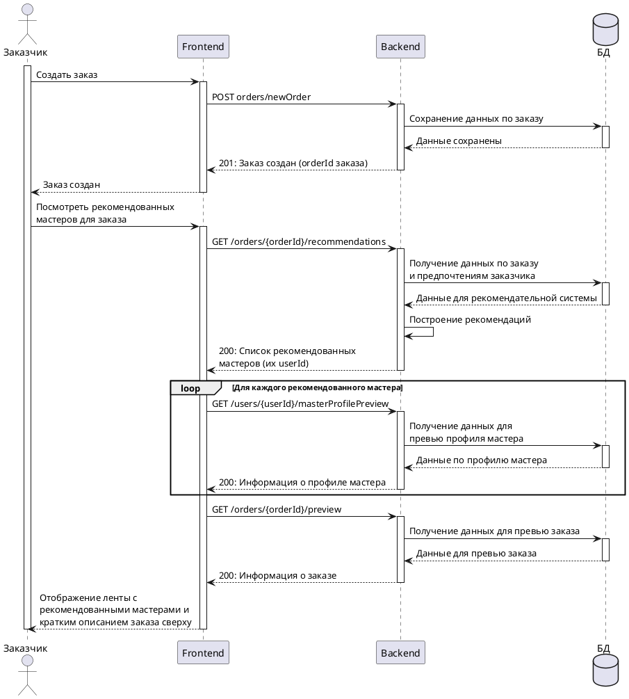

# UC: Просмотр ленты с рекомендованными мастерами после создания заказа

Шаблон описания use case на примере use case "Просмотр ленты с рекомендованными мастерами после создания заказа"

---
### Sequence diagram 

---

### Функциональные требования

**Цель**: отображать заказчикам мастеров, которые могут реализовать их заказ, и дать возможность ознакомиться с профилями мастеров

**Участники**: заказчик (Пользователь), лента просмотра мастеров (Система)

**Предусловие**: пользователь нажал "Создать заказ" на странице создания заказа

**Основной сценарий**: 

1. Система запрашивает в БД данные по заказу и данные по предпочтениям заказчика

2. Система передает данные на вход в рекомендательную систему

3. Рекомендательная система ранжирует мастеров по схожести предпочтений мастера  и предпочтений заказчика

4. Система отображает заказчику первых 10 рекомендованных мастеров

5. Пользователь листает ленту вниз-вверх и смотрит на карточки мастеров. Внизу ленты есть кнопка "Посмотреть еще мастеров", при нажатии на которую система отображает следующих 10 рекомендованных мастеров.

6. Для каждого мастера система отображает:

- Фамилия, имя, отчество

- Город

- Уровень навыков (начинающий/средний/опытный)

- Тип занятия (вяжу/шью)

- Тэги предпочитаемого стиля в одежде (строгий/современный/и т.д.)

7. Для каждого мастера в ленте система предлагает:

- Посмотреть профиль мастера

- Оставить заказ

8. Пользователь нажимает на карточку мастера

9. Система отображает страницу с профилем мастера. В профиле мастера указаны:

- Фамилия, имя, отчество

- Город

- Описание профиля

- Фото профиля

- Примеры работ с фото

- Ссылки на аккаунты мастера в социальных сетях

10. Пользователь смотрит профиль мастера и нажимает вернуться назад в ленту

11. Пользователь нажимает "Оставить заказ" в карточке понравившегося мастера 

**Постусловия**: открылся чат между заказчиком и мастером

**Приоритет**: высокий

**Обоснование**: лента с рекомендациями является итогом работы рекомендательной системы, поэтому важно, чтобы представление рекомендованных мастеров было удобным и можно было быстро перейти к диалогу с мастером. 

### Нефункциональные требования

- Лента с рекомендациями мастеров, которые могут реализовать заказ, должна грузиться не более, чем за 2 секунды.