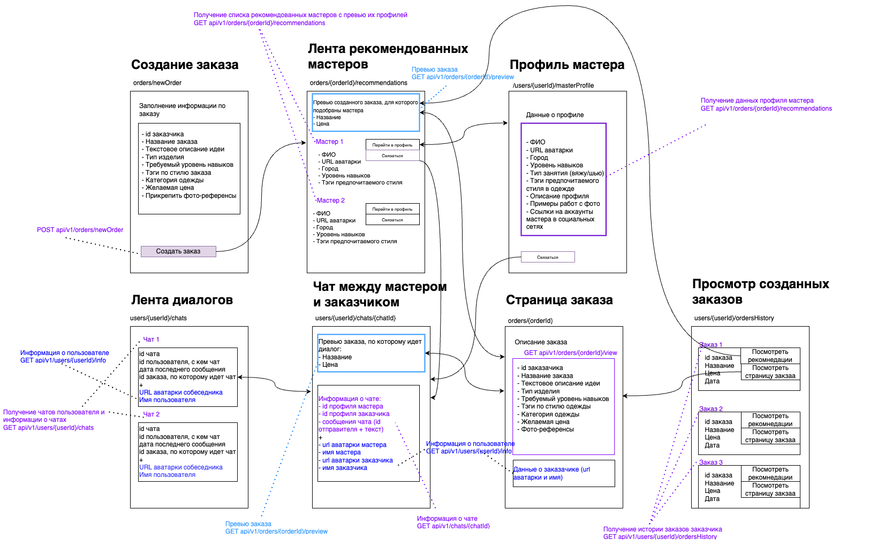

# Экран: **Название экрана**

Шаблон описания экрана
:::info
User Story
:::

---

## Описание
Описание экрана

---

## Макет

---

## Элементы экрана
- **Элемент экрана**: Описание элемента.
- **Элемент экрана**: Описание элемента.
- **Элемент экрана**: Описание элемента.

---

## Источники данных

| Метод | Элемент экрана  | Описание              |
| -------- | ------- | --------------------- |
| |  |  |
| |  |  |